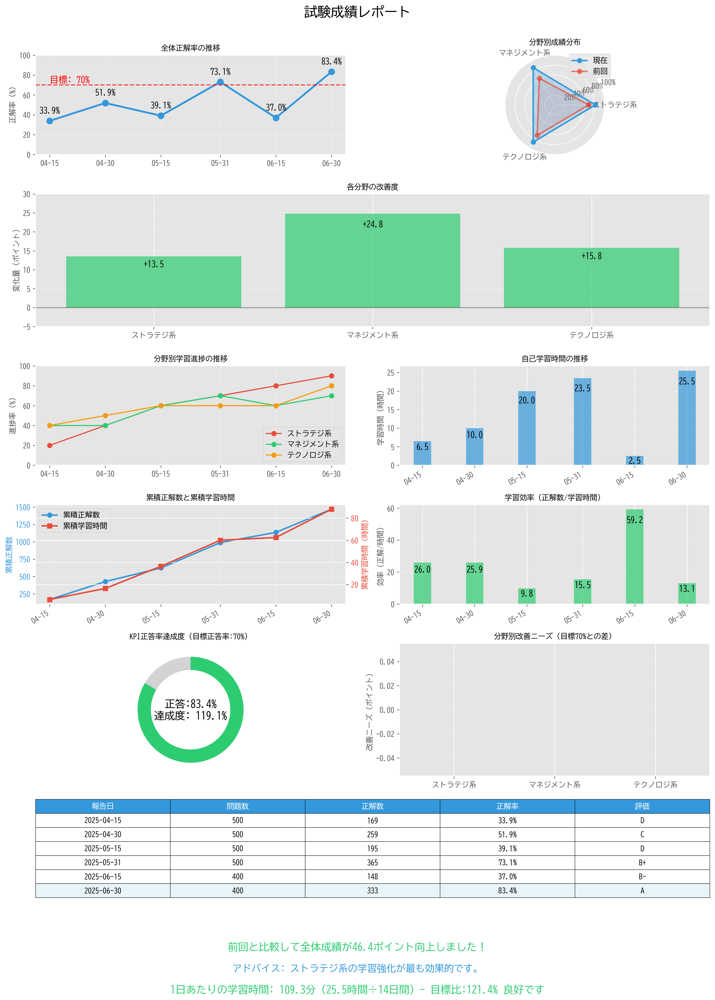

# 📘 試験成績レポート自動生成ツール

このプロジェクトは、ITパスポート試験などの模擬試験結果をもとに、視覚的かつ定量的に成績を分析するPythonスクリプトです。CSV形式で記録された学習・試験履歴から、10種類以上のグラフを含むレポート画像を自動生成し、学習成果や改善点を一目で把握できます。

---

## 📊 出力サンプル



---

## ✅ 主な特徴

本ツールが生成するレポートには、以下の視覚要素が含まれます：

- 📈 **全体正解率の推移**
- 🕸️ **分野別成績（レーダーチャート）**
- 📊 **各分野の改善度（前回比）**
- 🔁 **分野別学習進捗率**
- ⌛ **自己学習時間の推移**
- 🔁 **累積正解数と累積学習時間の二軸グラフ**
- ⚙️ **学習効率（正解数 ÷ 学習時間）**
- 🎯 **KPI達成度ゲージ（目標正解率70%）**
- 📉 **分野別改善ニーズ（弱点分析）**
- 🧾 **成績サマリーテーブル（評価付き）**
- 📢 **前回との比較メッセージ＋学習アドバイス**
- 📆 **1日あたり学習時間の分析（目標比付き）**

---

## 📁 ディレクトリ構成

```bash
.
├── plot_score_report.py        # メインスクリプト
├── score_report_final.csv      # 入力データ（CSV形式）
├── score_report.png            # 自動生成される出力レポート
└── README.md                   # 本ドキュメント
```

---

## 🧩 CSVファイル仕様

`score_report_final.csv` には以下の列が必要です：

| 列名 | 内容 |
|------|------|
| `date` | 記録日（例：2025-05-15） |
| `accuracy_per` | 正解率 (%) |
| `total_questions` | 出題数 |
| `correct_answers` | 正解数 |
| `grade` | 評価（例：C-, B） |
| `strategy_per`, `management_per`, `technology_per` | 各分野の正解率 (%) |
| `strategy_progress`, `management_progress`, `technology_progress` | 各分野の学習進捗率 (%) |
| `study_hours` | 自己学習時間（単位：時間） |

### CSVサンプル

```csv
date,accuracy_per,total_questions,correct_answers,grade,strategy_per,management_per,technology_per,strategy_progress,management_progress,technology_progress,study_hours
2025-04-15,0,0,0,D,0,0,0,0,0,0,0
2025-04-30,41.0,100,41,C-,31.3,43.5,46.7,20,40,40,2
2025-05-15,50.0,100,50,C-,52.6,71.4,44.9,60,80,60,3
```

---

## 💻 実行方法

### 1. 依存ライブラリのインストール

```bash
pip install matplotlib pandas numpy
```

### 2. スクリプト実行

```bash
python plot_score_report.py
```

実行後、`score_report.png` が `output/` ディレクトリに出力されます。

---

## 🔤 フォントについて

- 標準では日本語対応フォント **BIZ UDGothic** を使用しています。
- サーバー環境やフォントがない場合、自動的に類似の日本語フォント（Meiryo, Yu Gothicなど）にフォールバックします。
- フォントパスは以下で指定可能です。

```python
font_path = "/workspace/fonts/BIZUDGothic-Regular.ttf"
```

---

## 📌 備考

- レポートは GUI 不要の `matplotlib` を使用して PNG 形式で出力されるため、サーバー環境でも利用可能です。
- KPIや改善ニーズなど、自己学習改善に向けた分析要素を多数含んでいます。

---
